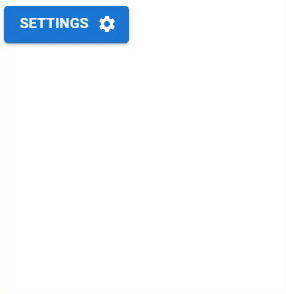

# :newspaper: Nestable React MUI Menu

This is a mobile friendly MUI (v5) menu with infinitely nestable sub-menus.

Changes the content of the menu based on which sub-menu is currently active, keeping the menu in a compact form allowing for easy mobile integration.

## :information_desk_person: Exports

The following components (and corresponding interfaces) are exported:

- `NestableMenu` - The raw menu component. This will require the anchor element to be managed externally.

- `NestableMenuButton` - A MUI button wrapping the Menu component, handling the anchoring internally.

## :computer: Contributing

Feel free to push pull requests for [the project](https://github.com/KieranSutherland/nestable-mui-menu). Please make sure to stick to the coding style used throughout the project.

1. Clone the project from GitHub.
2. Create a new branch.
3. `yarn install && yarn dev` and in your terminal you will see the port vite has opened on `localhost`.
4. Make your changes.
5. Open a pull request.

## :scroll: License

This project is licensed under the terms of the [MIT license](/LICENSE).